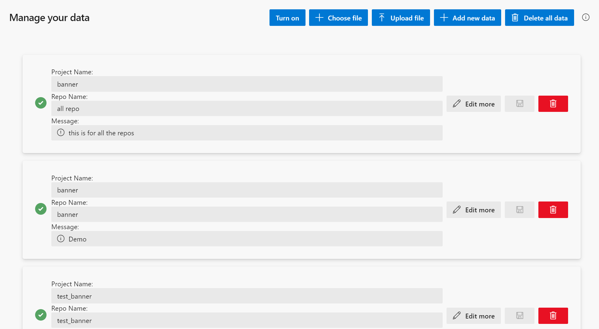

### Introduction
This repo is bulit based on https://github.com/microsoft/banner-settings-ado-extension and realize the funtion of repo/project-specific banner.  

### Features

The whole design of the UI is not much different than that of the original one. I made three changes here:
- Add a button to let the user upload the configuration file.
- Add a toggle to let the user enable/disable the extension.
- Add a new field representing the displaying level for each banner configuration. The supported levels are: Info, Warning and Error.

### Restrictions

- Currently the banner will display again when you revisit the current page or refresh the page. The only way to delete the banner is through organization-level control pane, or wait for the banner out of date.

### Building the project

Before you run the following scripts, make sure you have completed these operations.
- In ado-manifests\azure-devops-extension-dev.json, change the "publisher" to your publisher name.
- (option) In ado-manifests\azure-devops-extension-dev.json, reset the id, version and other properties of the extension.

Just run:

    npm run build:dev
    npm run package:dev

* if you got an error like that "'webpack' is not recognized as an internal or external command", just run "run "npm install --save-dev webpack webpack-cli"" to install it locally.

This produces a .vsix file which can be uploaded to the [Visual Studio Marketplace](https://marketplace.visualstudio.com/azuredevops)

Publish it to your own publisher by running:

    npm run publish:dev

* It require a global personal access token. If you don't have one, just publish it through [Visual Studio Marketplace](https://marketplace.visualstudio.com/azuredevops).

You can then serve the extension locally and visit your newly published dev environment extension using

    npm run dev

### Contributing

This project welcomes contributions and suggestions.  Most contributions require you to agree to a
Contributor License Agreement (CLA) declaring that you have the right to, and actually do, grant us
the rights to use your contribution. For details, visit https://cla.opensource.microsoft.com.